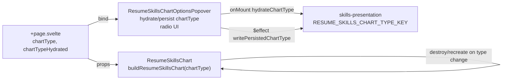

# Plan — resume-skills-chart-type-picker

## Objective restatement

Done means the resume skills explorer offers a third popover pane with a four-option chart-type radio group (bar default, polar, radar, scatter) in a responsive four-column grid, a third `Popover.Trigger` header button that selects that pane on hover, page-level bindable `chartType` state shared with the chart, persisted chart type in `skills-presentation`, and `ResumeSkillsChart` renders the selected Chart.js variant from the same `chartSkillsFromSelection` rows.

## Scope boundary

### In scope

- Extend `ChartOptionsPane` and add `ResumeSkillsChartType` in `types.ts`.
- Third popover pane: chart-type radio group (bar, polar, radar, scatter) in responsive grid (up to 4 columns).
- Third header trigger in `Popover.Trigger` child snippet; `pointerenter` → `selectedPane = 'chartType'`.
- Page bridge: `chartType` + `chartTypeHydrated` on `+page.svelte`, bound to popover and chart.
- Persist/hydrate chart type in `skills-presentation.ts` (sibling localStorage key).
- `skills-chart-config.ts`: registration helpers per chart family + builders for polar, radar, scatter; refactor bar registration naming for symmetry.
- `ResumeSkillsChart.svelte`: accept `chartType`, destroy/recreate on type change, dynamic `aria-label`.
- `ResumeSkillsChartOptionsPopover.svelte`: bindable `chartType` / `chartTypeHydrated`, hydration `$effect`, chart-type pane markup/styles.
- Vitest updates: popover component spec, chart-config unit tests, optional source spec for page bindings.
- Validation: `npm run lint`, `npm run check`, `npm test -- --run`, `npm run build`.

### Out of scope

- Removing or redesigning domains / tech-stacks panes.
- No-JS Chart.js rendering (resume skills explorer stays `{#if isJsEnabled}` only).
- New npm dependencies or Chart.js plugins.
- Legend redesign, axis label copy review beyond functional defaults in this plan.
- `ResumeSkillsExplorer` reintroduction (remains deleted per Phase 2 split).
- Relocating `skills-explorer/` files into per-component ADR-001 folders.

## Component/file map

| Path | Action | Purpose |
| ---- | ------ | ------- |
| `src/lib/ui/skills-explorer/types.ts` | **Modify** | Add `ResumeSkillsChartType`, extend `ChartOptionsPane` with `'chartType'` |
| `src/lib/ui/skills-explorer/index.ts` | **Modify** | Export `ResumeSkillsChartType` |
| `src/lib/utils/skills-presentation.ts` | **Modify** | `RESUME_SKILLS_CHART_TYPE_KEY`, read/write/hydrate chart type |
| `src/lib/utils/skills-chart-config.ts` | **Modify** | Per-type registration + `buildCategoryProficiency*Chart` builders + dispatcher |
| `src/lib/ui/skills-explorer/ResumeSkillsChart.svelte` | **Modify** | `chartType` prop, destroy/recreate lifecycle, type-aware repaint |
| `src/lib/ui/skills-explorer/ResumeSkillsChartOptionsPopover.svelte` | **Modify** | Third trigger, chart-type pane, bindable chart type + hydration |
| `src/routes/resume/+page.svelte` | **Modify** | Own and bind `chartType` / `chartTypeHydrated` to siblings |
| `src/lib/ui/skills-explorer/ResumeSkillsChartOptionsPopover.svelte.spec.ts` | **Modify** | Third trigger + chart-type pane assertions |
| `src/lib/utils/skills-chart-config.spec.ts` | **Create** | Builder `type` and empty-selection contracts per chart type |
| `src/lib/ui/skills-explorer/skills-explorer-split.source.spec.ts` | **Modify (optional)** | Assert page binds `chartType` if source-level AC desired |

**Estimated production touch count:** ~7 files (+ 1–2 spec files). **Recommended scope file count:** 9–10 files total.

## Interface contracts

### Types (`src/lib/ui/skills-explorer/types.ts`)

```ts
/** Chart.js visualization variants for the resume skills explorer. */
export const RESUME_SKILLS_CHART_TYPES = ['bar', 'polar', 'radar', 'scatter'] as const;
export type ResumeSkillsChartType = (typeof RESUME_SKILLS_CHART_TYPES)[number];

export type ChartOptionsPane = 'skillStacks' | 'domains' | 'chartType';
```

- Default: `'bar'`.
- Builder validates persisted strings against `RESUME_SKILLS_CHART_TYPES`; invalid → `'bar'`.

### Persistence (`src/lib/utils/skills-presentation.ts`)

```ts
export const RESUME_SKILLS_CHART_TYPE_KEY = 'cxii-resume-skills-chart-type';

export const readPersistedChartType = (): ResumeSkillsChartType | null => { /* trim; validate union; remove invalid */ };
export const writePersistedChartType = (chartType: ResumeSkillsChartType): void => { /* localStorage.setItem */ };
export const hydrateChartType = (): ResumeSkillsChartType => { /* read or 'bar' */ };
```

- Use existing `canPersistSkillsViewMode()` guard (no duplicate storage probe).
- Hydration runs in popover `onMount` (browser), same as `hydrateIncludedSkillIds`.
- Persistence runs in popover `$effect` when `chartTypeHydrated === true` and `chartType` changes (mirror inclusion write).

### Shared builder args

```ts
export type BuildResumeSkillsChartArgs = {
  datasourceRecords: SkillRecord[];
  categories: readonly SkillCategoryMeta[];
  includedSkillIds: ReadonlySet<string>;
};
```

All builders call `chartSkillsFromSelection(args.datasourceRecords, args.categories, args.includedSkillIds)` → `rows: SkillRecord[]`.

Shared helpers (existing): `proficiencyBarValue`, `categoryChartColor`, `getProficiencyLevel`, `PROFICIENCY_CHART_MAX` / axis labels from bar config.

### Chart.js registration strategy (`skills-chart-config.ts`)

Track registered families in module-level flags (extend current `resumeBarChartRegistered` pattern):

| `chartType` | Register once (dynamic `import('chart.js')`) |
| ----------- | --------------------------------------------- |
| `bar` | `BarController`, `BarElement`, `CategoryScale`, `LinearScale`, `Legend`, `Tooltip` |
| `polar` | `PolarAreaController`, `ArcElement`, `RadialLinearScale`, `Legend`, `Tooltip` |
| `radar` | `RadarController`, `PointElement`, `LineElement`, `Filler`, `RadialLinearScale`, `Legend`, `Tooltip` |
| `scatter` | `ScatterController`, `PointElement`, `LinearScale` (x + y), `Legend`, `Tooltip` |

```ts
export async function ensureResumeSkillChartRegistered(chartType: ResumeSkillsChartType): Promise<void>;
export function buildResumeSkillsChart(
  chartType: ResumeSkillsChartType,
  args: BuildResumeSkillsChartArgs
): ChartConfiguration<ResumeSkillsChartType>;
```

- `buildResumeSkillsChart` delegates to `buildCategoryProficiencyBarChart` (rename optional; keep export name for tests), `buildCategoryProficiencyPolarChart`, `buildCategoryProficiencyRadarChart`, `buildCategoryProficiencyScatterChart`.
- **No** single global register of all controllers unless Builder prefers one `ensureAllResumeSkillChartsRegistered()` called once on first paint — allowed if simpler; must still avoid duplicate `Chart.register` calls.

### Concrete Chart.js data shapes (same `rows` for all types)

**Empty selection** (all types): mirror bar — one placeholder label (`'No skills selected'`), single zero/neutral point, `legend.display: false`, `responsive: true`, `maintainAspectRatio: false`.

**Non-empty `rows`:**

1. **`bar`** (unchanged semantics): vertical bar chart; `labels = rows.map(r => r.name)`; one dataset; `data = proficiencyBarValue(row)`; per-bar `backgroundColor` / `borderColor` from `categoryChartColor(row.categoryId)`; y scale 0–4 with proficiency tick labels; x title unchanged.

2. **`polar`** (`type: 'polarArea'`): `labels = rows.map(r => r.name)`; one dataset `label: 'Proficiency level'`; `data = rows.map(proficiencyBarValue)`; per-segment colors from category; `options.scales.r` (radial): `min: 0`, `max: PROFICIENCY_CHART_MAX`, tick callback → proficiency names (reuse bar y tick callback); tooltip callback → skill name + tier + years (same as bar).

3. **`radar`** (`type: 'radar'`): same `labels` and single dataset as polar; `fill: true` with low opacity on background; `borderColor` per point from category; radial scale identical to polar; point labels may be dense — accept same behavior as bar x-axis crowding (no new product work).

4. **`scatter`** (`type: 'scatter'`): one dataset; points:

```ts
data: rows.map((row) => ({
  x: row.yearsOfExperience,
  y: proficiencyBarValue(row)
}));
```

- `backgroundColor` / `borderColor` per point from `categoryChartColor(row.categoryId)`.
- `options.scales.x`: `beginAtZero: true`, title `{ display: true, text: 'Years of experience' }`.
- `options.scales.y`: reuse bar y scale (proficiency 0–4, tier labels).
- Tooltip: title = skill name (`rows[dataIndex].name`), label = proficiency tier + years.

**Rationale:** Scatter needs two numeric axes; years × proficiency is derivable from `SkillRecord` without inventing indices. Document in `build-log.md` if product prefers a different mapping (see Open questions).

### `ResumeSkillsChart` lifecycle

```ts
type Props = {
  skillRecords: SkillRecord[];
  skillCategories: readonly SkillCategoryMeta[];
  includedSkillIds: SvelteSet<string>;
  inclusionHydrated?: boolean;
  chartType?: ResumeSkillsChartType; // default 'bar'
  chartTypeHydrated?: boolean; // default false
  onChartReady?: (ready: boolean) => void;
};
```

**Repaint gate:** `$effect` runs when `browser && inclusionHydrated && chartTypeHydrated && canvasEl`.

**Type change:** keep `let lastChartType: ResumeSkillsChartType | null = null` (or compare in effect):

- If `chartInstance !== null` && `chartType !== lastChartType`: `chartInstance.destroy(); chartInstance = null`.
- `await ensureResumeSkillChartRegistered(chartType)`.
- `blueprint = buildResumeSkillsChart(chartType, args)`.
- If `chartInstance === null`: `new Chart(context, blueprint)`.
- Else: `chartInstance.data = blueprint.data; Object.assign(chartInstance.options, blueprint.options); chartInstance.update('none')` **only when type unchanged**.

**Aria:**

```ts
const describeCanvasAria = (): string => {
  const typeLabel = { bar: 'Vertical bar chart', polar: 'Polar area chart', radar: 'Radar chart', scatter: 'Scatter chart' }[chartType];
  return `${typeLabel} of ${includedCount} skills; proficiency tier encoded on ${chartType === 'scatter' ? 'vertical axis, years of experience on horizontal axis' : 'radial or vertical scale'}`;
};
```

(Builder may tighten copy; must not remain bar-only.)

### `ResumeSkillsChartOptionsPopover`

```ts
type Props = {
  // existing props...
  chartType?: ResumeSkillsChartType; // $bindable, default 'bar'
  chartTypeHydrated?: boolean; // $bindable, default false
};
```

**Third trigger** (in existing `button-group`, order: Tech stacks | Skills by domain | **Chart type** — label exact string Builder uses: **`Chart type`** unless Open question resolved):

```svelte
onpointerenter={() => { selectedPane = 'chartType'; }}
```

**Chart-type pane markup pattern** (mirror tech-stacks):

```svelte
<div class="skills-explorer-pane skills-explorer-pane--chart-type">
  <h4 class="title-medium" id="skills-chart-type-heading">Chart type</h4>
  <fieldset class="fieldset__chart-types" aria-labelledby="skills-chart-type-heading">
    <legend class="chart-types__legend sr-only">Select chart visualization type</legend>
    <ul class="chart-types skillset-controls">
      {#each CHART_TYPE_OPTIONS as option (option.value)}
        <li class="chart-type__item">
          <label class="chart-type__toggle">
            <input
              type="radio"
              name="resume-skills-chart-type"
              value={option.value}
              checked={chartType === option.value}
              onchange={() => { chartType = option.value; }}
            />
            <span class="chart-type__label label-large">{option.label}</span>
          </label>
        </li>
      {/each}
    </ul>
  </fieldset>
</div>
```

`CHART_TYPE_OPTIONS` constant in popover script (or imported from types module):

| value | label |
| ----- | ----- |
| `bar` | Bar |
| `polar` | Polar |
| `radar` | Radar |
| `scatter` | Scatter |

**Responsive grid CSS** (mirror `.tech-stacks`, extend to 4 columns):

```css
.chart-types {
  display: grid;
  grid-template-columns: repeat(1, minmax(0, 1fr));
  gap: 0 1rem;
}
@media (min-width: 540px) {
  .chart-types { grid-template-columns: repeat(2, minmax(0, 1fr)); }
}
@media (min-width: 800px) {
  .chart-types { grid-template-columns: repeat(4, minmax(0, 1fr)); }
}
```

(Tech stacks uses 3 columns at 800px; chart types need **4** at 800px per objective — use 4 at `min-width: 800px` as above.)

### `+page.svelte` bridge

```ts
let chartType = $state<ResumeSkillsChartType>('bar');
let chartTypeHydrated = $state(false);
```

```svelte
<ResumeSkillsChartOptionsPopover
  ...
  bind:chartType
  bind:chartTypeHydrated
/>
<ResumeSkillsChart
  ...
  {chartType}
  {chartTypeHydrated}
/>
```

### Data flow



## ADR references

### ADR-001 — Project File and Folder Structure

**Implication:** All UI changes stay in `src/lib/ui/skills-explorer/`; chart builders stay in `src/lib/utils/skills-chart-config.ts`; persistence in `skills-presentation.ts`; route wiring limited to `src/routes/resume/+page.svelte`. No `lib/server/` changes.

### ADR-004 — Semantic HTML and Accessibility Standards

**Implication:** Chart-type pane uses `fieldset`, sr-only `legend`, and native radio inputs with visible labels (same pattern as tech-stacks). Header triggers keep `aria-controls` / `aria-expanded`. Chart wrapper keeps `role="img"` with type-aware `aria-label`. No `role="button"` on divs.

### ADR-006 — Type and Schema Conventions

**Implication:** Define `RESUME_SKILLS_CHART_TYPES` with `as const` and derived union; validate localStorage reads against that tuple; do not add TypeScript `enum`.

### ADR-007 — State Management Conventions

**Implication:** Page owns shared `chartType` via `$state` and `$bindable` into popover; chart receives props (not bindable on chart — read-only consumer). Hydration/persistence `$effect` in popover only. Use `$derived` for counts/labels, not `$effect`. No global store class.

### ADR-011 — UI Component Library — bits-ui

**Implication:** Third trigger remains inside existing `Popover.Trigger` + `mergeProps` child snippet with `openOnHover`; do not add a parallel popover primitive.

## Phases

### Phase 1 — Types, persistence, chart config

**Purpose:** Contracts and builders without UI.

**Files:** `types.ts`, `index.ts`, `skills-presentation.ts`, `skills-chart-config.ts`, `skills-chart-config.spec.ts`.

**Steps:**

1. Add `ResumeSkillsChartType`, `RESUME_SKILLS_CHART_TYPES`, extend `ChartOptionsPane`.
2. Add storage key + hydrate/read/write with union validation; default `'bar'`.
3. Implement `ensureResumeSkillChartRegistered(chartType)` and four builders + `buildResumeSkillsChart` dispatcher.
4. Add unit tests for each builder `type` and empty `rows` placeholder.

**Validation commands:** `npm run lint`, `npm run check`, `npm test -- --run src/lib/utils/skills-chart-config.spec.ts`

**Green means:** exit code 0; tests assert `configuration.type` per variant.

**Rollback:** revert utils/types only.

---

### Phase 2 — Popover pane + page bridge

**Purpose:** User-facing type selection and persistence wiring.

**Files:** `ResumeSkillsChartOptionsPopover.svelte`, `+page.svelte`, `ResumeSkillsChartOptionsPopover.svelte.spec.ts`.

**Steps:**

1. Add bindable `chartType` / `chartTypeHydrated`; hydrate in `onMount`; persist in `$effect`.
2. Add third trigger + chart-type pane + `.chart-types` grid styles.
3. Wire page bindings.
4. Extend popover spec (third button, pane radios, persistence mock optional).

**Validation commands:** `npm run lint`, `npm run check`, `npm test -- --run src/lib/ui/skills-explorer/ResumeSkillsChartOptionsPopover.svelte.spec.ts`

**Green means:** AC-01–03, AC-07, AC-10, AC-14–15 covered by tests/manual smoke.

**Rollback:** revert popover + page; Phase 1 utils remain harmless.

---

### Phase 3 — Chart component + full validation

**Purpose:** Render selected Chart.js type; destroy on type change.

**Files:** `ResumeSkillsChart.svelte`, optional `skills-explorer-split.source.spec.ts`.

**Steps:**

1. Add `chartType` / `chartTypeHydrated` props; gate `$effect`.
2. Implement destroy/recreate on `chartType` change; update-in-place when only inclusion changes.
3. Update `describeCanvasAria()` for all types.
4. Run full validation suite.

**Validation commands:**

```bash
npm run format
npm run lint
npm run check
npm test -- --run
npm run build
```

**Green means:** all commands exit 0; manual smoke on `/resume` with JS enabled — switch all four types, toggle skills, reload page confirms persisted type.

**Test intent:** chart-config unit tests (builders), popover interaction tests (pane/trigger), optional source test for `bind:chartType` on page.

**Rollback:** revert `ResumeSkillsChart.svelte`; popover/page still persist type but chart stays bar until Phase 3 restored.

## Open questions

1. **Scatter semantics (product):** This plan maps **x = years of experience**, **y = proficiency tier (0–4)**. If product wants category-index vs proficiency or a different pairing, human must confirm before release; Builder implements plan default and records deviation in `build-log.md` if directed.
2. **Third trigger label:** Plan uses **"Chart type"**; alternatives ("Visualization", "Chart") — Builder uses plan default unless Orchestrator/user specifies.
3. **Polar vs radar differentiation:** Both use radial scales and proficiency magnitude; copy/tooltip only differentiation — acceptable for v1 unless user requests distinct datasets (e.g., category-colored multiple datasets on radar).

**Builder must not invent answers** to items 1–3 without Orchestrator/human input; escalate via `build-log.md` when blocked.

## Planning decisions (explicit)

| Decision | Choice |
| -------- | ------ |
| Chart type persists to localStorage? | **Yes** — sibling key in `skills-presentation.ts`, same guard as inclusion |
| Default chart type | **`bar`** |
| Same data rows for all types? | **Yes** — `chartSkillsFromSelection` |
| Type change lifecycle | **Destroy + recreate** Chart instance when `chartType` changes |
| Inclusion-only change | **Update** existing instance (`data` + `options` + `update('none')`) |
| Responsive columns | 1 → 2 @540px → **4 @800px** (class `.chart-types`) |
| Scatter axes | Years (x) × proficiency (y) — see Open question 1 |
