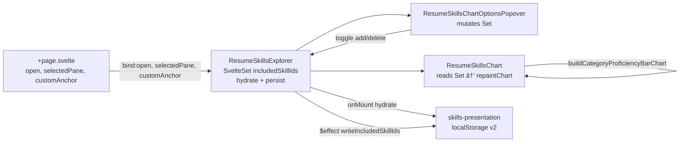
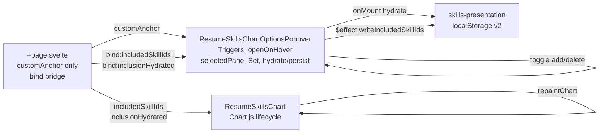

# Plan — skills-explorer-split-popover-chart

## Objective restatement

Done means the resume skills Chart.js canvas and the bits-ui options popover are separate components under `src/lib/ui/skills-explorer/`, with `ResumeSkillsExplorer` as a thin composer that owns shared inclusion state and persistence, the popover component structurally supports `Popover.Trigger` (hidden interim trigger + optional trigger snippet), and the resume page keeps its existing external buttons and `customAnchor` wiring with unchanged user-visible behavior.

## Scope boundary

### In scope

- Extract **chart-only** component (`ResumeSkillsChart.svelte`): canvas, Chart.js register/import, `repaintChart`, `onChartReady`, reads `includedSkillIds`.
- Extract **popover-only** component (`ResumeSkillsChartOptionsPopover.svelte`): domains and tech-stacks panes, inclusion toggles, popover-only UI state (`selectedDomain`, `selectedStackId`), bits-ui `Popover.*` tree with **required** `Popover.Trigger`, `customAnchor`, `bind:open`, optional **trigger snippet** for future migration.
- Refactor **`ResumeSkillsExplorer.svelte`** into a **thin composer**: hydrate/persist `includedSkillIds`, render chart + popover, preserve current public props for `+page.svelte`.
- Update **`src/lib/ui/skills-explorer/index.ts`** (and `src/lib/ui/index.ts` only if needed) to export new components where useful for tests or reuse.
- Document interim vs future trigger migration in popover `@component` block (external page buttons + `bind:open` + `selectedPane` today; real triggers via snippet later).
- Validation: `npm run lint`, `npm run check`, `npm test`, `npm run build`.

### Out of scope

- Any change under `sunrise2-ui` or outside `c:\Users\kenpo\projects\cxiius`.
- Removing page-level "Tech stacks" / "Skills by domain" buttons or the `skills-explorer-anchor` / `customAnchor` pattern (future task).
- Migrating those buttons to `Popover.Trigger` (future task).
- Rewrapping with `$lib/ui/popover/Popover.svelte` unless required for `customAnchor` (current CXII wrapper does not expose `customAnchor`; **use raw `bits-ui` Popover** in the skills popover component to match today and bits-ui docs).
- Chart UX redesign, new panes, legend work, or changes to `skills-chart-data` / `skills-chart-config` algorithms.
- New global stores, new npm packages, or ADR proposals.
- Relocating each file into separate ADR-001 single-component folders (keep the established **`skills-explorer/` feature folder** colocation).

## Component/file map

| Path | Action | Purpose |
| ---- | ------ | ------- |
| `src/lib/ui/skills-explorer/ResumeSkillsChart.svelte` | **Create** | Chart.js canvas, dynamic import, destroy lifecycle, repaints when `includedSkillIds` changes |
| `src/lib/ui/skills-explorer/ResumeSkillsChartOptionsPopover.svelte` | **Create** | bits-ui popover shell + domains/stacks panes; mutates `includedSkillIds`; optional `trigger` snippet |
| `src/lib/ui/skills-explorer/ResumeSkillsExplorer.svelte` | **Modify** | Thin composer: owns `includedSkillIds`, hydration, persistence `$effect`, composes chart + popover |
| `src/lib/ui/skills-explorer/index.ts` | **Modify** | Export new components (and types unchanged) |
| `src/lib/ui/skills-explorer/types.ts` | **Read** | `ChartOptionsPane` — no change expected |
| `src/lib/ui/skills-explorer/ResumeSkillsBaseline.svelte` | **Read** | Unchanged |
| `src/routes/resume/+page.svelte` | **Modify (minimal)** | Keep `chartOptionsOpen`, `chartOptionsPane`, `chartOptionsAnchorEl`, buttons; adjust only if composer markup/order requires a wrapper (target: prop-compatible drop-in) |
| `src/lib/utils/skills-presentation.ts` | **Read** | `hydrateIncludedSkillIds`, `writeIncludedSkillIds` — persistence API |
| `src/lib/utils/skills-chart-data.ts` | **Read** | Chart data helpers |
| `src/lib/utils/skills-chart-config.ts` | **Read** | Chart config builder |
| `src/lib/utils/skills-chart-data.spec.ts` | **Read** | No change unless chart props alter util contracts (not expected) |
| `src/lib/utils/skills-presentation.spec.ts` | **Read** | Persistence tests remain valid |
| `src/lib/ui/skills-explorer/ResumeSkillsChart.test.ts` | **Optional create** | Vitest + TestBed smoke: renders canvas wrapper, calls `onChartReady` when mocked Chart (only if Builder adds meaningful coverage) |
| `src/lib/ui/skills-explorer/ResumeSkillsChartOptionsPopover.test.ts` | **Optional create** | Asserts `Popover.Trigger` present in markup / snippet contract (only if added) |

**Decision:** `ResumeSkillsExplorer` **remains** the public entry point for the resume route; it is **not** deleted. It becomes the composer only.

## Interface contracts

### Shared types (existing)

```ts
// src/lib/ui/skills-explorer/types.ts
export type ChartOptionsPane = 'skillStacks' | 'domains';
```

### `includedSkillIds` ownership and data flow



| Concern | Owner | Mechanism |
| ------- | ----- | --------- |
| `includedSkillIds` instance | **Composer** | `let includedSkillIds = new SvelteSet<string>()` |
| Hydration | **Composer** | `onMount`: `hydrateIncludedSkillIds(skillRecords)` → clear/add to Set |
| Persistence | **Composer** | `$effect` (browser + hydrated flag): `writeIncludedSkillIds(skillRecords, includedSkillIds)` |
| Domain/stack pane UI state | **Popover** | `selectedDomain`, `selectedStackId` — local `$state`, not shared with chart |
| Chart repaint | **Chart** | `$effect` when `includedSkillIds` (and canvas ready) changes → `repaintChart()` |
| Popover open/pane | **Page → Composer → Popover** | `bind:open`, `selectedPane` props (unchanged interim) |

Popover mutations must call the same helpers as today (`toggleSkillInclusion`, `toggleCategoryInclusion`, `activateSkillStack`, `categoryCheckboxState` action) — move with popover component, not duplicated in composer.

### `ResumeSkillsExplorer` (composer) — public API unchanged

```ts
type ResumeSkillsExplorerProps = {
  skillRecords: SkillRecord[];
  skillCategories: readonly SkillCategoryMeta[];
  skillStacks: readonly SkillStackMeta[];
  onChartReady?: (ready: boolean) => void;
  open?: boolean; // $bindable — forwarded to popover Popover.Root
  selectedPane?: ChartOptionsPane; // default 'domains'
  customAnchor?: HTMLElement | null; // forwarded to Popover.Content
};
```

Markup order (preserve layout): popover (portal, does not affect document flow) + chart canvas block inside `.resume-skills-chart` wrapper. Composer holds **no** popover pane markup and **no** canvas logic.

### `ResumeSkillsChart`

```ts
type ResumeSkillsChartProps = {
  skillRecords: SkillRecord[];
  skillCategories: readonly SkillCategoryMeta[];
  /** Same Set reference as composer/popover; chart reads membership, does not replace the Set. */
  includedSkillIds: SvelteSet<string>;
  onChartReady?: (ready: boolean) => void;
};
```

- Exports no `open` / `selectedPane` / `customAnchor`.
- `describeCanvasAria()` stays here; `role="img"` on frame unchanged.
- `clientHydrated` flag: either composer sets "ready to persist" or chart signals mount — **composer** should gate persistence on hydration complete (move `clientHydrated` from monolith to composer).

### `ResumeSkillsChartOptionsPopover`

```ts
type ResumeSkillsChartOptionsPopoverProps = {
  skillRecords: SkillRecord[];
  skillCategories: readonly SkillCategoryMeta[];
  skillStacks: readonly SkillStackMeta[];
  open?: boolean; // $bindable → Popover.Root bind:open
  selectedPane?: ChartOptionsPane;
  customAnchor?: HTMLElement | null; // Popover.Content customAnchor={customAnchor ?? undefined}
  includedSkillIds: SvelteSet<string>; // same reference; mutates in place
  /** Optional. When provided, rendered inside Popover.Trigger (bits-ui child/snippet pattern). When omitted, render visually hidden native button Trigger for interim external controls. */
  trigger?: Snippet;
};
```

**bits-ui structure (required):**

```svelte
<Popover.Root bind:open>
  <Popover.Trigger><!-- snippet or sr-only placeholder --></Popover.Trigger>
  <Popover.Portal>
    <Popover.Content id="skills-chart-options" customAnchor={...} class="popover__content skills-explorer-popover">
      <!-- domains | skillStacks panes (unchanged logic) -->
    </Popover.Content>
  </Popover.Portal>
</Popover.Root>
```

**Interim (this task):** Page buttons set `chartOptionsOpen = true` and `chartOptionsPane` on `pointerenter`; `bind:open` on composer forwards to `Popover.Root`. `customAnchor` binds to zero-height anchor div above chart shell. Popover's default Trigger is **present but not the UX control** (e.g. `class="sr-only"` button, `tabindex="-1"`, `aria-hidden="true"` on trigger only if equivalent route to open is documented — page buttons keep `aria-expanded` / `aria-controls="skills-chart-options"`).

**Future (document only):** Move header buttons into `trigger` snippet as `Popover.Trigger` children; drop `customAnchor` when anchor equals trigger; page may drop duplicate `bind:open` or delegate to Trigger.

**Do not** use `$lib/ui/popover/Popover.svelte` for this panel unless extended with `customAnchor` and `id="skills-chart-options"` — out of scope.

### `+page.svelte` (interim contract)

Unchanged state variables:

- `chartOptionsOpen`, `chartOptionsPane`, `chartOptionsAnchorEl`
- Header `<button type="button">` with `aria-controls="skills-chart-options"`, `aria-expanded={chartOptionsOpen}`
- `<ResumeSkillsExplorer bind:open={chartOptionsOpen} selectedPane={chartOptionsPane} customAnchor={chartOptionsAnchorEl} ... />`

## ADR references

### ADR-001 — Project File and Folder Structure

**Implication:** Add `ResumeSkillsChart.svelte` and `ResumeSkillsChartOptionsPopover.svelte` beside existing explorer files in `src/lib/ui/skills-explorer/`; match PascalCase names; update `index.ts` exports; import by direct path from routes. No `lib/server/` or API changes.

### ADR-004 — Semantic HTML and Accessibility Standards

**Implication:** Preserve popover pane semantics (`h4`, `fieldset`/`legend` for stacks, checkbox/radio labels, `categoryCheckboxState` indeterminate action). Page-level buttons remain the named controls for opening (`aria-expanded`, `aria-controls`). Popover Trigger placeholder must not steal focus from page buttons (sr-only, `tabindex="-1"`). Any animation on popover content keeps `prefers-reduced-motion` patterns already in global/CSS. Do not remove `role="img"` + dynamic `aria-label` on chart frame.

### ADR-007 — State Management Conventions

**Implication:** All new/edited components use runes (`$props`, `$bindable`, `$state`, `$derived`, `$effect`). Shared inclusion uses in-component `SvelteSet` passed by reference — not a global store. Persistence side effect lives in composer `$effect`, not in chart. Avoid `$effect` for derived counts — keep `includedCount` as `$derived` in chart. No `writable()`, `export let`, or `$:`.

### ADR-011 — UI Component Library — bits-ui

**Implication:** Popover component imports `{ Popover } from 'bits-ui'` and follows documented structure including **`Popover.Trigger` inside `Popover.Root`** even when `Popover.Content` uses `customAnchor` (see bits-ui Popover "Custom Anchor" — Trigger remains in tree). Optional trigger snippet aligns with bits-ui Trigger `child` snippet pattern used in `$lib/ui/popover/Popover.svelte`. Fetch [popover llms.txt](https://bits-ui.com/docs/components/popover/llms.txt) if Builder needs API details.

## Open questions

1. **Hidden Trigger a11y detail:** Confirm with human whether interim `Popover.Trigger` should be `aria-hidden="true"` + `tabindex="-1"` only, or also `disabled`, given page buttons remain the accessible open controls — Builder must implement the plan's sr-only placeholder and flag in `build-log.md` if bits-ui requires Trigger to stay focusable.
2. **Export surface:** Export `ResumeSkillsChart` and `ResumeSkillsChartOptionsPopover` from `index.ts` for tests only vs public API — default **export both** from `skills-explorer/index.ts`; keep `src/lib/ui/index.ts` exporting only `ResumeSkillsExplorer` + `ResumeSkillsBaseline` unless Validator requires parity.
3. **Component tests:** No mandatory new `*.test.ts` unless Test agent adds AC coverage — optional smoke tests listed in file map.

**Builder must not invent answers** to product questions beyond the contracts above; escalate ambiguous Trigger markup via `build-log.md` → Orchestrator.

---

# Phase 2 — Page compose, popover-owned triggers & state

## Objective restatement (Phase 2)

Done means the resume page composes `ResumeSkillsChart` and `ResumeSkillsChartOptionsPopover` directly (no `ResumeSkillsExplorer`), the popover component owns header trigger buttons via bits-ui `Popover.Trigger` **child snippet** with **`openOnHover`**, owns `selectedPane`, `includedSkillIds` hydration/persistence, and internal open state, while the page only supplies content props, the **`customAnchor`** element for chart overlay positioning, and a minimal **`bind:includedSkillIds`** (plus hydration signal) bridge to the chart sibling.

## Scope boundary (Phase 2)

### In scope

- **Delete** `ResumeSkillsExplorer.svelte` when no longer referenced.
- **Move** from composer → popover: `includedSkillIds` `SvelteSet`, `onMount` → `hydrateIncludedSkillIds`, `$effect` → `writeIncludedSkillIds`, `clientHydrated` / `inclusionHydrated` gating.
- **Move** from page → popover: "Tech stacks" / "Skills by domain" header buttons into `Popover.Trigger` child snippet; drop page `chartOptionsOpen`, `chartOptionsPane`, and `onpointerenter` on external buttons.
- **Popover interaction:** bits-ui `Popover.Trigger` with `openOnHover`, `openDelay`, `closeDelay`; internal `selectedPane` set per button on hover (`pointerenter`/`mouseenter` on each trigger button).
- **Page thin wire:** render popover in skills section header + chart in shell; pass `customAnchor` from page-bound anchor div; `bind:includedSkillIds` and `bind:inclusionHydrated` (or equivalent) between popover and chart only.
- **Keep** `Popover.Content customAnchor={customAnchor ?? undefined}` (decision **1B**): page retains zero-height `skills-explorer-anchor` div bound to `chartOptionsAnchorEl`.
- **Raw bits-ui** `{ Popover } from 'bits-ui'` + `mergeProps` for child snippet — **do not** import `$lib/ui/popover/Popover.svelte`.
- Update **`src/lib/ui/skills-explorer/index.ts`** and **`src/lib/ui/index.ts`**: remove `ResumeSkillsExplorer`; export chart + popover as the public surface.
- Update/remove tests referencing `ResumeSkillsExplorer`, sr-only placeholder trigger, page `bind:open`, and composer ownership.
- Validation: `npm run lint`, `npm run check`, `npm test`, `npm run build`.

### Out of scope

- **Future:** chart type picker and multi-skill filter UX (prior explorer scope) — note only; not implemented in Phase 2.
- Removing `customAnchor` / page anchor div (anchor stays on page per **1B**).
- `$lib/ui/popover/Popover.svelte` wrapper adoption.
- Chart UX redesign, new panes, legend work, or changes to `skills-chart-data` / `skills-chart-config` algorithms.
- New global stores, new npm packages, or ADR proposals.
- Any change under `sunrise2-ui`.

## Component/file map (Phase 2)

| Path | Action | Purpose |
| ---- | ------ | ------- |
| `src/lib/ui/skills-explorer/ResumeSkillsChartOptionsPopover.svelte` | **Modify** | Own triggers (child snippet, two buttons), `openOnHover`, `selectedPane`, `includedSkillIds`, hydrate/persist; accept `customAnchor` from page; expose bindable inclusion ref + hydration flag for chart |
| `src/lib/ui/skills-explorer/ResumeSkillsChart.svelte` | **Read/minimal** | Unchanged contract: reads `includedSkillIds`, `inclusionHydrated`, `onChartReady`; no popover imports |
| `src/lib/ui/skills-explorer/ResumeSkillsExplorer.svelte` | **Delete** | Composer removed; logic absorbed by popover + page compose |
| `src/lib/ui/skills-explorer/index.ts` | **Modify** | Drop `ResumeSkillsExplorer` export; keep `ResumeSkillsChart`, `ResumeSkillsChartOptionsPopover`, `ResumeSkillsBaseline`, types |
| `src/lib/ui/index.ts` | **Modify** | Replace `ResumeSkillsExplorer` with chart + popover exports (or drop explorer-only export) |
| `src/routes/resume/+page.svelte` | **Modify** | Remove open/pane state and external button-group; compose popover (header) + chart (shell); keep anchor div + `onChartReady` / `data-explorer-ready` |
| `src/lib/ui/skills-explorer/ResumeSkillsChartOptionsPopover.svelte.spec.ts` | **Modify** | Assert built-in trigger buttons, `openOnHover`, ownership of hydration; remove sr-only placeholder expectations |
| `src/lib/ui/skills-explorer/skills-explorer-split.source.spec.ts` | **Modify** | Replace composer ACs with Phase 2 page-compose + popover-ownership source checks; drop `ResumeSkillsExplorer` reads |
| `src/lib/ui/header/Header.svelte` | **Read** | Reference for raw bits-ui `Popover.Trigger` usage (Phase 2 uses **child snippet** pattern instead) |
| `src/lib/ui/popover/Popover.svelte` | **Read only** | Reference for `mergeProps` + `{#snippet child({ props })}` — **do not use** |
| `src/lib/utils/skills-presentation.ts` | **Read** | Persistence API unchanged |

## Interface contracts (Phase 2)

### Data flow (Phase 2)



| Concern | Owner | Mechanism |
| ------- | ----- | --------- |
| `includedSkillIds` instance | **Popover** | `let includedSkillIds = new SvelteSet<string>()`; expose via `$bindable()` for page chart bridge |
| Hydration / persistence | **Popover** | `onMount` + `$effect` (moved from deleted composer) |
| `inclusionHydrated` | **Popover** | `$bindable(false)` until storage hydrate completes; chart gates first paint |
| `selectedPane` | **Popover** | Internal `$state<ChartOptionsPane>`; each trigger button sets pane on hover |
| Popover open | **Popover / bits-ui** | `Popover.Trigger openOnHover` (+ delays); **no** page `bind:open` |
| `customAnchor` | **Page → Popover** | Page `bind:this={chartOptionsAnchorEl}` on anchor div; prop to `Popover.Content` |
| Chart repaint | **Chart** | `$effect` on `includedSkillIds` when `inclusionHydrated` |
| Header trigger UX | **Popover** | Two buttons inside single `Popover.Trigger` child snippet |

### `ResumeSkillsChartOptionsPopover` (Phase 2 public API)

```ts
type ResumeSkillsChartOptionsPopoverProps = {
  skillRecords: SkillRecord[];
  skillCategories: readonly SkillCategoryMeta[];
  skillStacks: readonly SkillStackMeta[];
  /** Page-supplied anchor for panel positioning over chart shell (decision 1B). */
  customAnchor?: HTMLElement | null;
  /** Bindable reference to the same Set instance the chart reads; popover creates and mutates. */
  includedSkillIds?: SvelteSet<string>; // $bindable
  /** Bindable; true after client hydration from localStorage. */
  inclusionHydrated?: boolean; // $bindable
};
```

**Removed props (Phase 2):** `open`, `selectedPane`, optional external `trigger` snippet.

**bits-ui structure (Phase 2 — required):**

```svelte
<script lang="ts">
  import { Popover, mergeProps } from 'bits-ui';
  import { CaretDownIcon } from '$lib/ui/icons';
  // selectedPane, includedSkillIds, hydrate/persist live here
</script>

<Popover.Root bind:open={internalOpen}>
  <Popover.Trigger openOnHover openDelay={…} closeDelay={…}>
    {#snippet child({ props })}
      <div {...mergeProps(props, { class: 'button-group' })}>
        <button
          type="button"
          class="button"
          aria-controls="skills-chart-options"
          aria-expanded={internalOpen}
          onpointerenter={() => (selectedPane = 'skillStacks')}
        >
          Tech stacks
          <CaretDownIcon size="sm" ariaLabel="Caret down" />
        </button>
        <button
          type="button"
          class="button"
          aria-controls="skills-chart-options"
          aria-expanded={internalOpen}
          onpointerenter={() => (selectedPane = 'domains')}
        >
          Skills by domain
          <CaretDownIcon size="sm" ariaLabel="Caret down" />
        </button>
      </div>
    {/snippet}
  </Popover.Trigger>
  <Popover.Portal>
    <Popover.Content
      id="skills-chart-options"
      class="popover__content skills-explorer-popover"
      customAnchor={customAnchor ?? undefined}
    >
      <!-- domains | skillStacks panes (existing markup) -->
    </Popover.Content>
  </Popover.Portal>
</Popover.Root>
```

**Trigger architecture (decision 2A):**

- **Prefer:** one `Popover.Root` + one `Popover.Trigger` with **child snippet** rendering a **button-group wrapper** and **two `<button>` elements**.
- Spread bits-ui trigger `props` via `mergeProps(props, { class: 'button-group' })` onto the **wrapper** so hover/open targets the group; each inner button sets `selectedPane` on `pointerenter` so `Popover.Content` shows the correct pane before/at open.
- If hover grace-area or a11y breaks with wrapper delegation, Builder may split to two `Popover.Trigger` elements **only after** documenting bits-ui constraint in `build-log.md` and escalating — default remains **one Trigger**.

**Wide panel styles** (`.popover__content.skills-explorer-popover { width: 960px; }` and pane styles) **stay on the popover component**.

### `ResumeSkillsChart` (unchanged Phase 2 contract)

```ts
type ResumeSkillsChartProps = {
  skillRecords: SkillRecord[];
  skillCategories: readonly SkillCategoryMeta[];
  includedSkillIds: SvelteSet<string>;
  inclusionHydrated?: boolean;
  onChartReady?: (ready: boolean) => void;
};
```

### `+page.svelte` (Phase 2 minimal contract)

**Remove:**

- `chartOptionsOpen`, `chartOptionsPane` state
- `ChartOptionsPane` import (unless needed elsewhere)
- External `<div class="button-group">` with two buttons and `onpointerenter`
- `<ResumeSkillsExplorer … bind:open … selectedPane … />`

**Keep:**

- `chartOptionsAnchorEl` + `<div bind:this={chartOptionsAnchorEl} class="skills-explorer-anchor">`
- `skillsExplorerMounted` + `onChartReady` → `data-explorer-ready`
- Skills section header `<h3 id="skills-heading">`

**Add / replace:**

```svelte
<div class="skills-section__header">
  <h3 class="headline-small" id="skills-heading">Skills</h3>
  <ResumeSkillsChartOptionsPopover
    skillRecords={data.skillRecords}
    skillCategories={data.skillCategories}
    skillStacks={data.skillStacks}
    customAnchor={chartOptionsAnchorEl}
    bind:includedSkillIds
    bind:inclusionHydrated
  />
</div>
<div bind:this={chartOptionsAnchorEl} class="skills-explorer-anchor"></div>
<div class="skills-explorer-shell" data-explorer-ready={skillsExplorerMounted ? '' : undefined}>
  <ResumeSkillsChart
    skillRecords={data.skillRecords}
    skillCategories={data.skillCategories}
    {includedSkillIds}
    {inclusionHydrated}
    onChartReady={(ready) => {
      skillsExplorerMounted = ready;
    }}
  />
</div>
```

Page **does not** declare popover open/pane/hydration logic beyond receiving bindable refs for the chart bridge. Parent may omit pre-initializing `includedSkillIds` — popover creates the Set; bind propagates reference to chart.

### Barrel exports (Phase 2)

- `skills-explorer/index.ts`: export `ResumeSkillsChart`, `ResumeSkillsChartOptionsPopover`, `ResumeSkillsBaseline`, `ChartOptionsPane` type; **no** `ResumeSkillsExplorer`.
- `lib/ui/index.ts`: drop `ResumeSkillsExplorer`; export chart + popover (match existing barrel style).

## ADR references (Phase 2 — additional implications)

Same active ADRs as Phase 1; Phase 2 adds:

- **ADR-004:** Trigger buttons inside popover remain the accessible open controls (`aria-controls="skills-chart-options"`, `aria-expanded` synced to internal open). Keyboard users open via Enter/Space on trigger per bits-ui hover docs.
- **ADR-007:** Inclusion + pane + open state live in popover `$state` / `$effect`; page holds only anchor ref and bindable Set reference for sibling chart — no duplicated hydration.
- **ADR-011:** `openOnHover`, `openDelay`, `closeDelay` on `Popover.Trigger`; `customAnchor` on `Popover.Content`; child snippet uses bits-ui `mergeProps` pattern (see `$lib/ui/popover/Popover.svelte` for reference, not import).

## Open questions (Phase 2)

1. **Hover delay values:** Phase 1 page opened immediately on `pointerenter`. bits-ui defaults are `openDelay=700`, `closeDelay=300`. Builder should use **low** delays to preserve snappy hover UX unless human specifies otherwise — recommend `openDelay={0}` or `openDelay={100}` and `closeDelay={300}`; record chosen values in `build-log.md`.
2. **Trigger `props` merge target:** Plan prefers wrapper `div.button-group`; if bits-ui requires a single focusable trigger element, Builder escalates before switching to two-Trigger layout.
3. **Future chart type + skills controls:** Out of scope; a later task may extend popover panes or chart props — do not scaffold in Phase 2.

**Builder must not invent answers** beyond these contracts.
